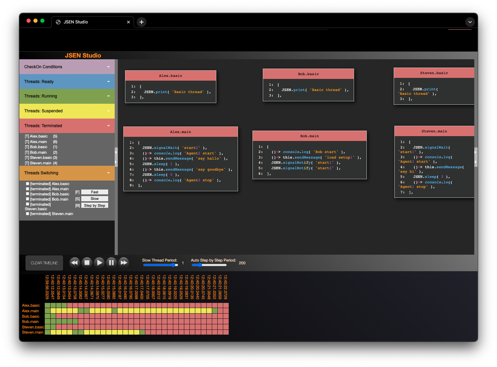

  

JSEN - JavaScript Executable Notation Project
====================================

JSEN is the counterpart of JSON. It extends the homoiconicity of JavaScript, giving the possibility to manipulate programs in a finer grain manner than what is currently possible.
The JSEN library provides a set of functions to manipulate JSEN data structures that can be used to store executable statements or run them in a concurent multi-threding environment through the JSEN Virtual Machine.
A description of all pure JSEN statements, the JSENThreadClass and the JSENVM API can be here in the repository.

You can find a more comprensive description of JSEN if the following paper:
 Title: From JSON to JSEN through Virtual Languages
 URL: https://www.ronpub.com/OJWT_2021v8i1n01_Ceravola.pdf

Installation 
===================================

JSEN can be installed simply by copying the `src` folder into your projects or by using `npm install jsen-lang`.

Documentation
===================================

The documentation is built using `jsdoc`. You can generate/udpate it by running `npm run docs`.

The generated documentation can be found in `doc/html`.

JSENStudio
===================================

JSENStudio is an interactive visual debugger of JSEN code.

Examples
===================================

This repository contains several examples, some are executable, some just illustrate the usage of JSEN/JSENVM.

### Executable:
- JSEN/examples/Benchmark/JSENBenchmark.js

  RUN in console: node JSENBenchmark.js

  This example shows performances of JSEN compared to pure JavaScript.
  It is also a good example showing the same algoritm implemented
  in pure JavaScrip and JSEN (so you can learn JSEN quiclky).

- JSEN/examples/JSENBrowserExample/JSENExample.js

  RUN in broser: file:///..your..repo..path.../JSEN/examples/JSENBrowserExample/JSENExample.html

  This example shows 3 threads that controls, each of them, the selection of
  an Ace editor. You can see here how to start different threads.
  Open the browser JavaScript console to see the output of the execution.

- JSEN/examples/JSENBrowserExample/JSENExample2.js

  RUN in broser: file:///..your..repo..path.../JSEN/examples/JSENBrowserExample/JSENExample2.html

  This example shows 3 threads that animates a red ball into a div.
  You can see here how to start/stop/renew different threads.
  Open the browser JavaScript console to see the output of the execution.

- JSEN/examples/JSENStudio/JSENExample1.js

  RUN in browser: file:///..your..repo..path.../JSEN/JSENStudio/index.html?jsenSrc=../examples/JSENStudio/JSENExample1.js

  This example shows the execution of 3 different threads each doing something different.
  It demonstrate how the JSEN Studio debugger works. To start the example click on the 
  play button in the JSEN Studio VCR control icons. To stop, click the stop button.
  To step (once threads are stopped), double click the play button.

- JSEN/examples/JSENStudio/JSENExample2.js

  RUN in browser: file:///..your..repo..path.../JSEN/JSENStudio/index.html?jsenSrc=../examples/JSENStudio/JSENExample2.js

  This example shows threads synchronized with each other. It shows usage of 
  signalInit/Notify/Wait and sleep.

- JSEN/JSENStudio/index.html

  RUN in browser: file:///..your..repo..path.../JSEN/JSENStudio/index.html?

  This example executes JSEN/examples/JSENStudio/JSENExample2.js by default.

### Illustrative:

- JSEN/examples/async1.js

  This example shows the comparison of asyncronous implementation of some
  algorithms. It is useful to notice the differences in the solutions.

- JSEN/examples/Avatar/Ego.js

  This example shows the usage of JSEN code extracted from a real application.

- JSEN/examples/tutorial/exampleDBInJSEN.js

  This example shows the usage of JSEN code extracted from a real application.

- JSEN/examples/JZENPorting/*

  In this folder there are some examples (not fully implemented) that shows
  how JSEN could be ported to other languages. It shows example of porting to
  Java, Matlab and Python. Some of them require further work to be completely
  supporting the JSEN virtual language.

License
===================================

This project is licensed under the BSD 3-clause license - see the [LICENSE.md](LICENSE.md) file for details.
The code presented here is original and do not depend on external software.

Disclaimer
===================================

The copyright holders are not liable for any damage(s) incurred due to improper use of this software.

Authors (in alphabetical order)
===================================

* <a href="https://github.com/antonelloceravola">Antonello Ceravola</a>
* Catalina Ioan
* <a href="https://github.com/frankjoublin">Frank Joublin</a>
